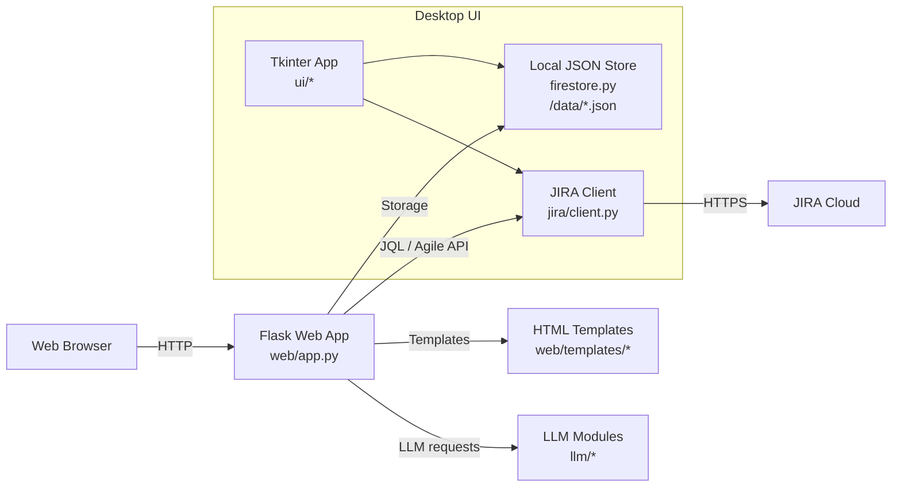

# Vibe-a-thon Agile Tool

This repository hosts the Vibe-a-thon Agile Tool (a.k.a. Agile_tool_utitity), a lightweight Agile planning tool with a web UI (Flask) and a desktop UI (Tkinter). It integrates with JIRA for search, sprint management, and story allocation, and uses local JSON storage for capacity/QBR data.

## Features
- Capacity planning by sprint with team inputs and computed availability
- Story backlog search from JIRA using JQL, allocation to sprints
- QBR capacity planning across multiple sprints
- JIRA integrations: search, update fields, add issues to sprint
- Simple desktop UI for similar workflows

## Architecture


## Module Guide
- Web server: `web/app.py` — Flask routes for features, stories, sprint, QBR, configuration
- Templates: `web/templates/*` — pages rendered client-side; grids via `ag-grid`
- JIRA client: `jira/client.py` — JIRA REST and Agile API calls
  - Search by JQL: `jira/client.py:541`
  - Add issues to sprint: `jira/client.py:462`
  - Update sprint per issue: `jira/client.py:1257`
  - Open sprint names: `jira/client.py:1328`
- Local storage: `firestore.py` — JSON-backed persistence under `data/`
  - Save sprint capacity: `firestore.py:22`
  - Get sprint names/capacity: `firestore.py:27`, `firestore.py:31`
  - Save QBR capacity: `firestore.py:35`
  - Save sprint allocations: `firestore.py:56`
- Desktop UI: `ui/app.py`, `ui/sprint_pages.py`, `ui/qbr_pages.py`
  - Sprint capacity page: `ui/sprint_pages.py:1`
  - Retrieve sprint: `ui/sprint_pages.py:116`
- Config: `config/store.py` with `config/config.json` for JIRA/LLM settings

## Meetings
- Page: `web/templates/meeting_upload.html`, route: `web/app.py:707`
- Purpose: Upload or paste meeting transcripts and process them via a Cloud Function.
- Actions: `MOM` (Minutes of Meeting), `SA` (Sentimental Analysis), `DSM` (Daily Standup), `RET` (Retrospection).
- Backend API: `POST /api/meeting/process_transcript` (`web/app.py:711`) forwards multipart/form-data to Cloud Function:
  - Endpoint: `https://us-central1-learngenaiapp.cloudfunctions.net/process_transcript`
  - Fields: `Action`/`action` and `File`/`file` (or `Transcript`/`text` for raw text)
- Output: JSON payload with optional `publish` details and `html` preview. The UI also supports publishing results to Confluence; configure Confluence under `Configuration → Confluence`.

## Key Web Endpoints
- Sprint Capacity UI: `GET /sprint/capacity` → `web/templates/sprint_capacity.html`
- Allocate Stories UI: `GET /sprint/allocate` → `web/templates/sprint_allocate.html`
- Retrieve Plan UI: `GET /sprint/retrieve` → `web/templates/sprint_retrieve.html`
- QBR Capacity UI: `GET /qbr/capacity` → `web/templates/qbr_capacity.html`
- Open Sprint Names: `GET /api/jira/open_sprints` → `web/app.py:657`
- Sprint Capacity CRUD:
  - `POST /api/sprint/capacity/save` → `web/app.py:647`
  - `POST /api/sprint/capacity/get` → `web/app.py:630`
- Allocate Stories: `POST /api/sprint/allocate_stories` → `web/app.py:668`

## Local Development
- Prerequisites: Python 3.11+
- Install deps:
```bash
pip install -r requirements.txt
```
- Run web server:
```bash
python3 -c "from web.app import app; app.run(host='127.0.0.1', port=5050, debug=True)"
# Open http://127.0.0.1:5050/
```
- Configure JIRA: Web UI → Configuration → JIRA Configuration (`/config/jira`) and save `url`, `user`, `token`, `project`.

## Docker
- Build image:
```bash
docker build -t agile-tool:latest .
```
- Run container:
```bash
docker run -e PORT=8080 -p 8080:8080 agile-tool:latest
# Open http://localhost:8080/
```

## Deploy to GCP (Cloud Run)
1. Authenticate and set project:
```bash
gcloud auth login
gcloud config set project <PROJECT_ID>
```
2. Enable services:
```bash
gcloud services enable artifactregistry.googleapis.com run.googleapis.com cloudbuild.googleapis.com secretmanager.googleapis.com
```
3. Create Artifact Registry and configure Docker auth:
```bash
gcloud artifacts repositories create agile-tool-repo \
  --repository-format=docker --location=us-central1 \
  --description="Agile Tool containers"
gcloud auth configure-docker us-central1-docker.pkg.dev
```
4. Build and push image with Cloud Build:
```bash
gcloud builds submit --tag us-central1-docker.pkg.dev/$PROJECT_ID/agile-tool-repo/agile-tool:latest .
```
5. Deploy to Cloud Run:
```bash
gcloud run deploy agile-tool \
  --image us-central1-docker.pkg.dev/$PROJECT_ID/agile-tool-repo/agile-tool:latest \
  --region us-central1 --allow-unauthenticated --port 8080 \
  --memory 512Mi --cpu 1
```
6. Optional: Mount config via Secret Manager (for `config/config.json`):
```bash
gcloud secrets create agile-tool-config
gcloud secrets versions add agile-tool-config --data-file=config/config.json

gcloud run deploy agile-tool \
  --image us-central1-docker.pkg.dev/$PROJECT_ID/agile-tool-repo/agile-tool:latest \
  --region us-central1 --allow-unauthenticated --port 8080 \
  --add-volume name=cfg,secret=agile-tool-config \
  --volume-mounts volume=cfg,mount-path=/app/config \
  --memory 512Mi --cpu 1
```

## Data Storage
- Sprint capacity: `data/sprint_capacity.json`
- Sprint allocations: `data/sprint_allocations.json`
- QBR capacity: `data/qbr_capacity.json`

## Notes
- The app uses `gunicorn` in the container (`web.app:app`).
- JIRA integration requires valid credentials and project key set via configuration.
 - The Meetings page invokes a Google Cloud Function; ensure the function is deployed and accessible. Update the URL in `web/app.py:764` if your function location differs.
